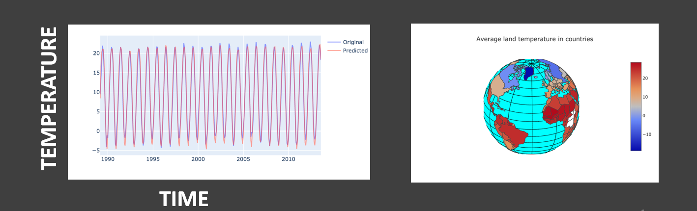

### Climate Change Forecasting Using Deep Learning

* Analyze changes in global temperatures from 17th century till now 
* Building a multivariate deep learning based predictive time series model to forecast the global average temperatures

[code and html file](https://github.com/msdat/climate-change-forecasting)
